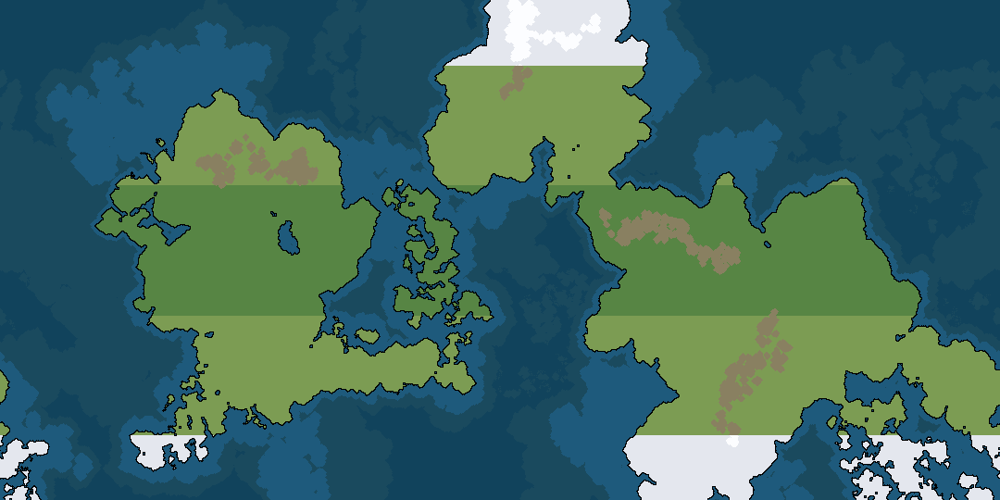

# Mapgen
A world map generator submitted as a project for GEOG 1105 in Fall 2020 at Mount Royal University.
Written by Olga Koldachenko.

## Current Features
- Random heightmap generation
- Water height adjustment
- Axial tilt adjustment
- Export to PNG
- Export heightmap as PNG

